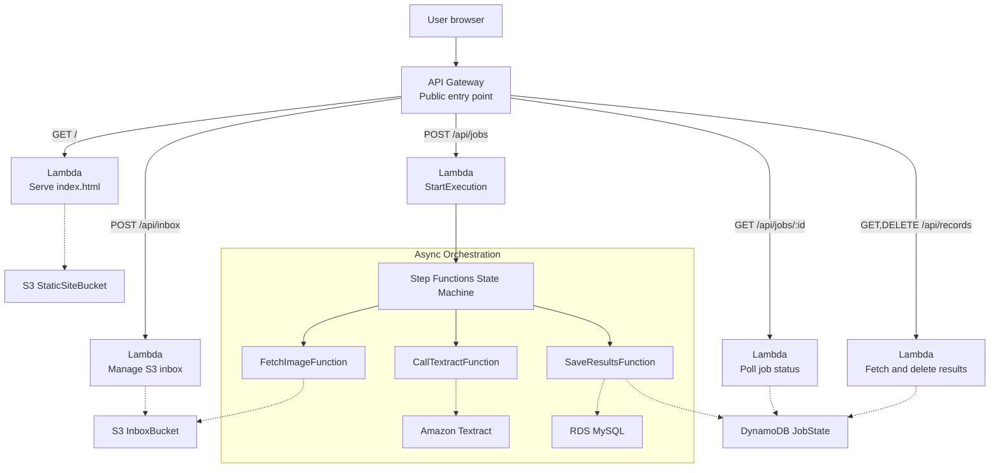

# CMSC 471 Final Project — Image-to-Text Application

A serverless, 4-tier AWS application that extracts text from images using Amazon Textract, built with Infrastructure as Code using AWS SAM.

## Project Overview

This project demonstrates a production-grade serverless architecture deployed entirely through AWS SAM templates, with BDD acceptance tests, DevOps traceability, and cost optimization strategies.

**Key Technologies:**
- AWS Lambda (compute)
- Amazon Textract (OCR)
- AWS Step Functions (orchestration)
- DynamoDB (NoSQL state)
- S3 (object storage with lifecycle policies)
- API Gateway (REST API)
- RDS MySQL `db.t3.micro` (structured results)
- CloudWatch (monitoring)
- AWS SAM (Infrastructure as Code)

**Constraints (AWS Academy Learner Lab):**
- Uses `LabRole` only — no custom IAM roles (`iam:CreateRole` is blocked)
- Textract instead of Bedrock (per Learner Lab allowlist)
- API Gateway instead of CloudFront for edge traffic

## Architecture



## Getting Started

### Prerequisites
- AWS Academy Learner Lab session active
- AWS SAM CLI installed
- Python 3.11

### Build

```bash
# Build all Lambda packages locally (no Docker required).
# Compiled dependencies (e.g. pymysql) are vendored into each handler's
# deployment package by SAM via pip install -r requirements.txt -t .
sam build
```

> **Note:** Do NOT use `--use-container`. Docker is not available in the
> Academy lab dev environment; SAM builds Python packages natively.
> If you have compiled C-extension deps, vendor them first:
> ```bash
> pip install -r src/save_results/requirements.txt \
>             -t src/save_results/ --platform linux_x86_64 \
>             --only-binary :all:
> ```

### Deploy

```bash
sam deploy
# Accept the changeset when prompted.
# Note the ApiEndpoint output — paste it into any external API clients.
```

### Upload the frontend

Copy the output of `FrontendDeployCommand` from the stack Outputs and run it:

```bash
aws s3 cp ./frontend/index.html s3://<StaticSiteBucket>/index.html
```

### Database schema

The RDS instance is provisioned empty. Run this once after the first deploy
(replace `<RDS_ENDPOINT>` with the `ResultsDatabaseEndpoint` output value):

```bash
mysql -h <RDS_ENDPOINT> -u cmsc471admin -p cmsc471results <<'SQL'
CREATE TABLE IF NOT EXISTS results (
  job_id        VARCHAR(64)   PRIMARY KEY,
  filename      VARCHAR(512),
  extracted_text MEDIUMTEXT,
  status        VARCHAR(32),
  created_at    TIMESTAMP DEFAULT CURRENT_TIMESTAMP
);
SQL
```

### Run acceptance tests

```bash
pip install pytest pytest-bdd boto3 requests
pytest tests/acceptance -v
```

## Documentation

- [Architecture Details](docs/architecture.md)
- [Cost Analysis](docs/tco.md)
- [Well-Architected Review](docs/well-architected.md)

## Teardown

Run the teardown commands **in this order** before deleting the stack.
Skipping them will leave non-empty buckets and cause `DELETE_FAILED`.

```bash
# 1. Remove the frontend HTML
aws s3 rm s3://<StaticSiteBucket>/index.html

# 2. Empty the inbox bucket (images + Glacier restore receipts)
aws s3 rm s3://<InboxBucket> --recursive

# 3. Delete the stack
aws cloudformation delete-stack --stack-name cmsc471-final --region us-east-1
```

The helper `Outputs` keys `FrontendTeardownCommand`, `InboxTeardownCommand`,
and `RemoveStackCommand` print the exact commands with bucket names filled in.

> **Cost warning — delete the stack when done!**
> The NAT Gateway + its Elastic IP cost ~**$32/month** even with zero traffic.
> The RDS `db.t3.micro` costs ~**$12/month** even when idle.
> Together they drain ~**$44/month** of Learner Lab credits while the stack
> sits undeleted. Always run teardown at the end of each lab session.
