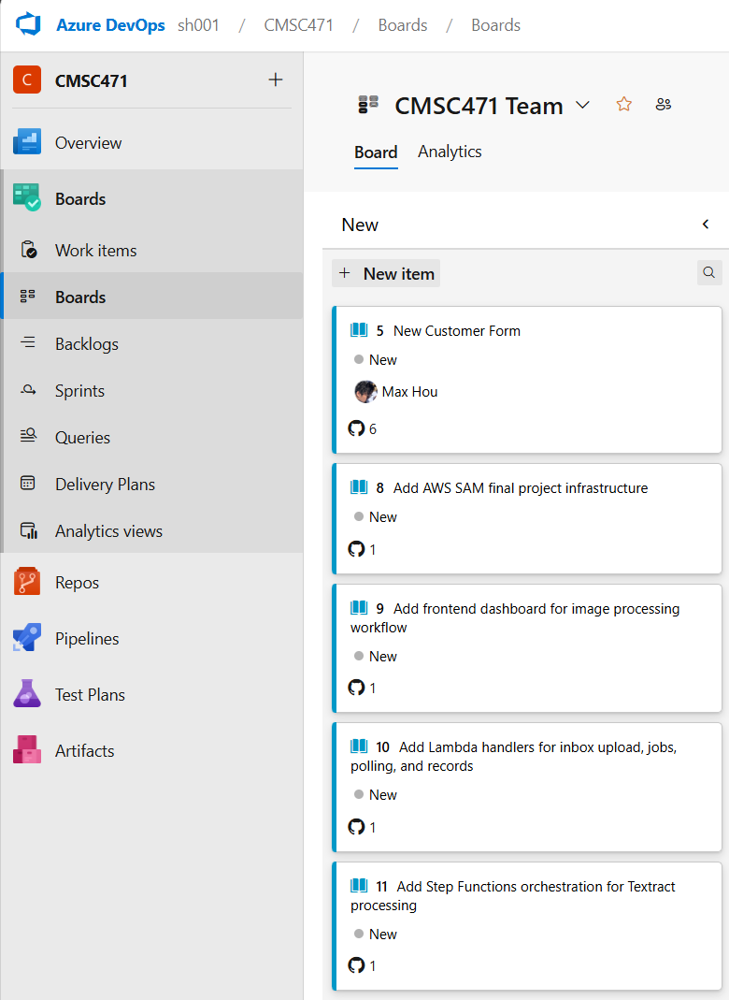
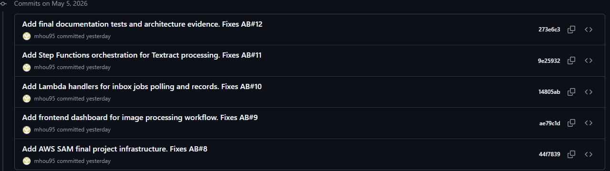
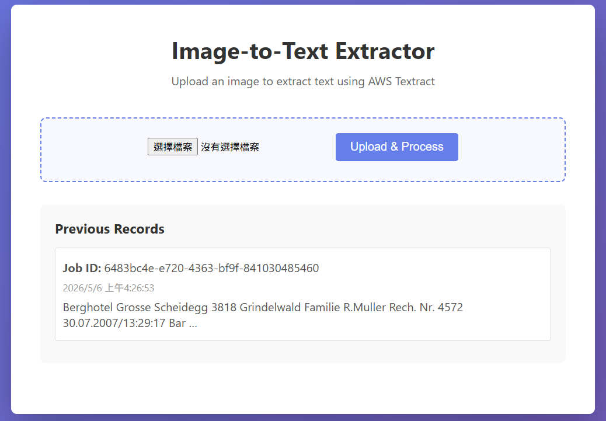
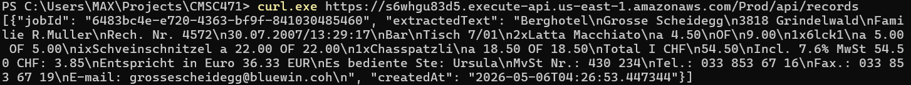
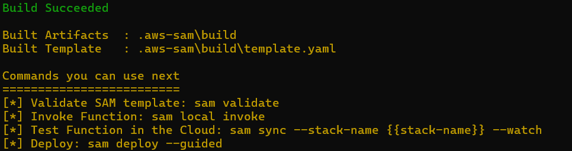
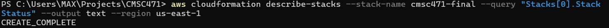
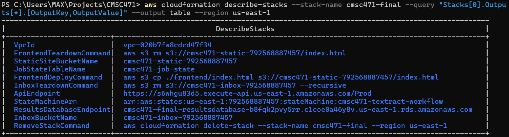

# CMSC 471 Final Project Portfolio

Prepared by: Max Hou



---

## 1. User Stories & Source Control — Agile and DevOps

This project uses Azure DevOps and GitHub for end-to-end traceability. Five Azure DevOps User Stories were completed and linked to GitHub commits using the `Fixes AB#` syntax.

### Completed User Stories

- **AB#8:** Add AWS SAM final project infrastructure
- **AB#9:** Add frontend dashboard for image processing workflow
- **AB#10:** Add Lambda handlers for inbox upload, jobs, polling, and records
- **AB#11:** Add Step Functions orchestration for Textract processing
- **AB#12:** Add final documentation, tests, and architecture evidence

### DevOps Board Evidence

The Azure DevOps board shows the completed project work items. Each user story is connected to a GitHub commit through the Development section.


### GitHub Commit Evidence

Each user story is linked to the corresponding GitHub commit. The commits use the `Fixes AB#` syntax to connect source control changes to Azure Boards work items.



---

## 2. Frontend Application & Data Integration

The frontend application allows users to upload an image and start an image-to-text extraction workflow using Amazon Textract.

### Interface and Capabilities

- The frontend is provided through `frontend/index.html`.
- Users can upload an image file for OCR processing.
- The application creates a job ID for each upload.
- The backend starts an AWS Step Functions workflow.
- The extracted text is returned through API endpoints.
- Records can be retrieved from the deployed API.

### Frontend Running in Browser

The deployed API Gateway endpoint successfully served the frontend application in the browser.



### API Records Response

The `/api/records` endpoint returned extracted text from Amazon Textract. This confirms that the uploaded image was processed and the OCR result was saved and retrieved through the backend API.



---

## 3. Infrastructure-as-Code & AWS Deployment

The infrastructure is deployed using AWS SAM and defined in `template.yaml`.

### Key Technologies

- AWS Lambda
- Amazon Textract
- AWS Step Functions
- DynamoDB
- S3
- API Gateway
- RDS MySQL `db.t3.micro`
- CloudWatch
- AWS SAM

### AWS Academy Learner Lab Constraints

- The project uses the AWS Academy `LabRole` because custom IAM role creation is blocked.
- Amazon Textract is used instead of Amazon Bedrock because Textract is available in the Learner Lab environment.
- API Gateway is used as the public HTTPS entry point.
- The application is deployed in `us-east-1`.

### Deployment Evidence

The SAM template was validated and the Lambda functions were built successfully.



The CloudFormation stack was successfully created/updated using SAM deploy.



### CloudFormation Outputs

The deployed stack outputs include the API endpoint, S3 buckets, DynamoDB table, Step Functions state machine, RDS endpoint, and teardown commands.



### Main AWS Resources

- **API Gateway:** Public HTTPS entry point for the web application and backend routes.
- **S3 StaticSiteBucket:** Stores the frontend `index.html`.
- **S3 InboxBucket:** Stores uploaded images.
- **Lambda Functions:** Handle index serving, inbox upload, job submission, polling, records, and workflow steps.
- **Step Functions:** Orchestrates the Textract workflow.
- **Amazon Textract:** Extracts text from uploaded images.
- **DynamoDB:** Stores job status and metadata.
- **RDS MySQL:** Stores structured OCR results.
- **CloudWatch Logs:** Captures logs for Lambda functions and Step Functions.
- **VPC, Subnets, NAT Gateway, and Security Groups:** Support private RDS access.

---

## 4. Architecture, Security, & Compliance

### Architecture Diagram

```mermaid
graph TD
    User[User browser] --> APIG[API Gateway<br/>Public entry point]
    APIG -->|GET /| L0[Lambda<br/>Serve index.html]
    APIG -->|POST /api/inbox| LInbox[Lambda<br/>Manage S3 inbox]
    APIG -->|POST /api/jobs| LSubmit[Lambda<br/>StartExecution]
    APIG -->|GET /api/jobs/:id| LPoll[Lambda<br/>Poll job status]
    APIG -->|GET,DELETE /api/records| LRecords[Lambda<br/>Fetch and delete results]

    L0 -.-> S3Web[S3 StaticSiteBucket]
    LInbox -.-> S3Store[S3 InboxBucket]
    LSubmit --> SF[Step Functions State Machine]
    LPoll -.-> DDB[DynamoDB JobState]
    LRecords -.-> DDB

    subgraph Serverless[Async Orchestration]
        SF --> L1[FetchImageFunction]
        SF --> L2[CallTextractFunction]
        SF --> L3[SaveResultsFunction]
        L2 -.-> Textract[Amazon Textract]
        L3 -.-> RDS[RDS MySQL]
    end

    L1 -.-> S3Store
    L3 -.-> DDB