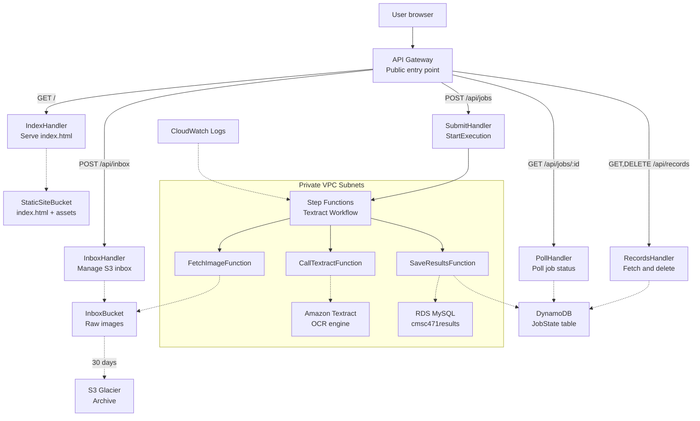

# Architecture — CMSC 471 Final Project

## Overview

A fully serverless, 4-tier image-to-text application deployed via AWS SAM into AWS Academy Learner Lab. Users upload images through a browser; AWS Step Functions orchestrates Lambda functions to run OCR via Amazon Textract and persist results across a polyglot data layer.

## Learner Lab Substitutions

| Blocked service | Substitute | Reason |
|---|---|---|
| Amazon Bedrock | Amazon Textract | Not on Learner Lab allowlist |
| CloudFront | API Gateway (`GET /`) | Not on Learner Lab allowlist |
| Custom IAM Roles | Pre-provisioned `LabRole` | IAM role creation blocked |
| Aurora Serverless v2 | `db.t3.micro` MySQL RDS | Verify quota before deploying |

---

## Four-Tier Breakdown

### Tier 1 — Presentation / Edge

| Resource | Purpose |
|---|---|
| `AWS::Serverless::Api` (`ApiGateway`) | Public HTTPS entry point (replaces CloudFront) |
| `IndexHandler` Lambda | Serves `index.html` from S3 on `GET /` |
| `StaticSiteBucket` S3 | Stores `index.html`, `style.css`, `app.js` |

### Tier 2 — Sync API / Compute

| Resource | Purpose |
|---|---|
| `InboxHandler` Lambda | `POST/GET/DELETE /api/inbox` — manages S3 inbox objects |
| `SubmitHandler` Lambda | `POST /api/jobs` — calls `StepFunctions.StartExecution` |
| `PollHandler` Lambda | `GET /api/jobs/{id}` — reads job status from DynamoDB |
| `RecordsHandler` Lambda | `GET/DELETE /api/records` — reads/deletes results |

### Tier 3 — Async Orchestration

| Resource | Purpose |
|---|---|
| `TextractWorkflowStateMachine` | Step Functions Standard state machine |
| `FetchImageFunction` Lambda | Step 1: validates image exists in S3 inbox |
| `CallTextractFunction` Lambda | Step 2: calls `textract.detect_document_text` |
| `SaveResultsFunction` Lambda | Step 3: writes to DynamoDB + RDS (in private VPC subnets) |

State machine flow:

```
FetchImage → CallTextract → SaveResults
     ↓             ↓             ↓
 HandleError   HandleError   HandleError
     └─────────────┴─────────────┘
         Updates DynamoDB status=FAILED
```

Each step retries up to 3 times with exponential backoff before routing to `HandleError`.

### Tier 4 — Polyglot Persistence

| Resource | Purpose |
|---|---|
| `InboxBucket` S3 | Raw uploaded images; lifecycle → Glacier after 30 days |
| `JobStateTable` DynamoDB | Job metadata: `jobId`, `status`, `extractedText`, timestamps |
| `ResultsDatabase` RDS MySQL | Structured results: `jobId`, `extractedText`, `createdAt` |

---

## Network Foundation

```
VPC 10.0.0.0/16
├── PublicSubnet1  10.0.1.0/24  (AZ-a) ─── Internet Gateway
├── PublicSubnet2  10.0.2.0/24  (AZ-b) ─── Internet Gateway
├── PrivateSubnet1 10.0.3.0/24  (AZ-a) ─── NAT Gateway
└── PrivateSubnet2 10.0.4.0/24  (AZ-b) ─── NAT Gateway

RDS instance and SaveResultsFunction Lambda live in private subnets.
All other Lambdas run outside the VPC (access S3/DynamoDB via IAM).
```

---

## Mermaid Diagram



---

## Deployment Commands

```bash
# First-time deploy
sam build
sam deploy --guided --profile lab

# Rapid iteration (code-only changes)
sam sync --watch --stack-name cmsc471-final --profile lab

# Teardown (proves 100% IaC)
sam delete --stack-name cmsc471-final --profile lab
```

---

## Key Design Decisions

1. **No CloudFront** — API Gateway handles edge traffic per Learner Lab constraint.
2. **db.t3.micro** instead of Aurora Serverless v2 — smaller Learner Lab quota footprint.
3. **SaveResultsFunction in VPC** — only this Lambda needs private RDS access; others stay outside VPC to avoid cold-start overhead.
4. **DynamoDB for job polling** — fast, eventually-consistent reads without opening RDS connections on every poll.
5. **S3 Glacier lifecycle** — raw images archived after 30 days, cutting storage cost ~88%.
